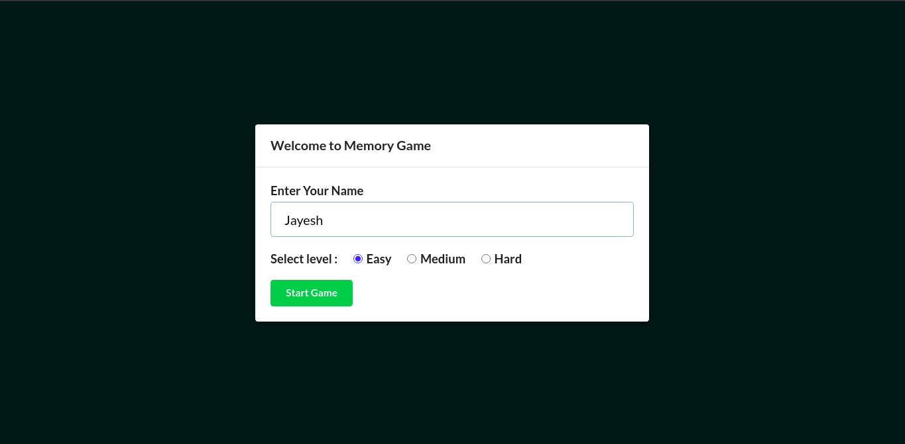
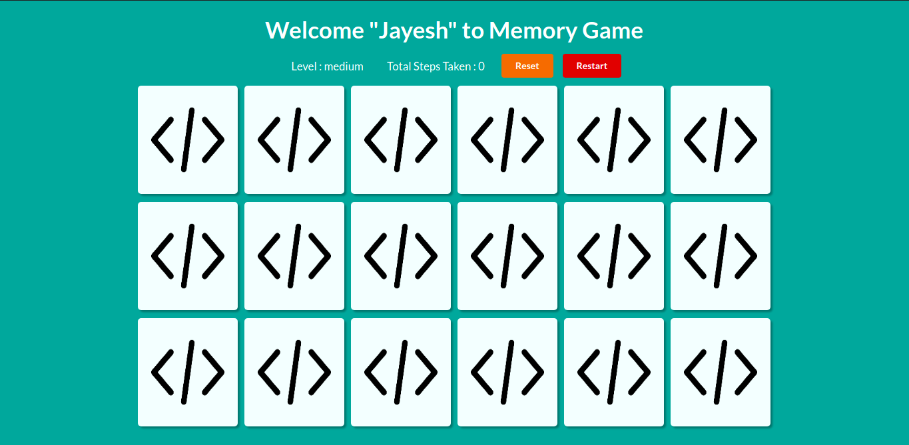
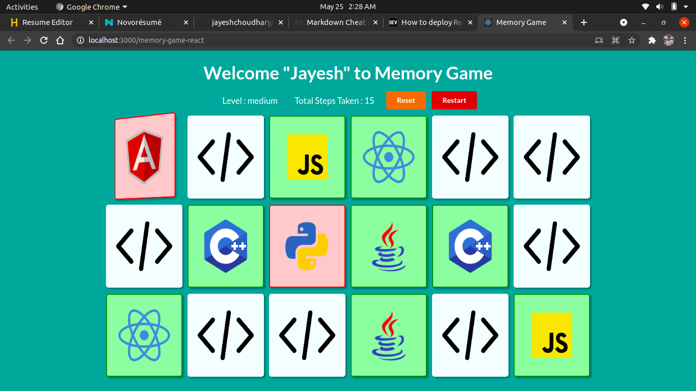
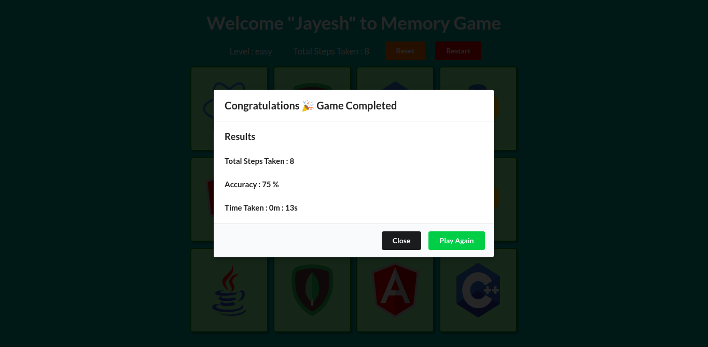

# Memory Game
### Project is hosted live at : https://jayeshchoudhary.github.io/memory-game-react/

---
Project is made using Reactjs, Semanti Ui React
This is a game which I have build while learning reactjs 
Features of Memory game
- user can enter his name
- select difficulty level (3 levels)
- match the cards as quick as possible
- at then end it will give you accuracy
- reset and restart game
## Project Screenshots

